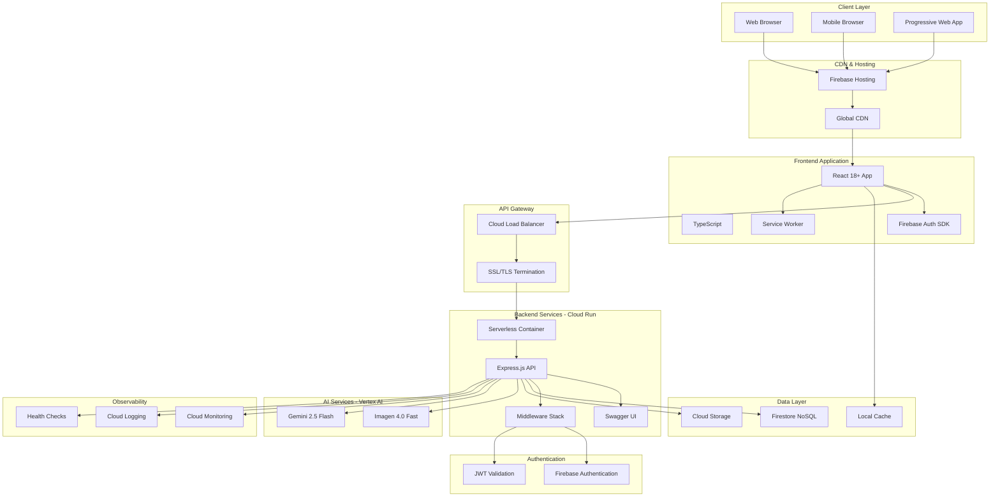
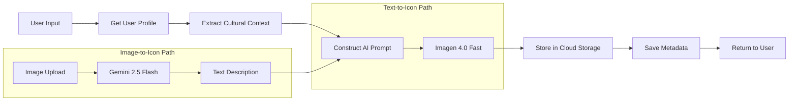
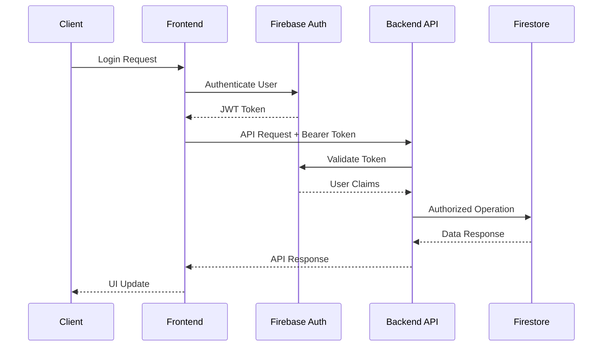
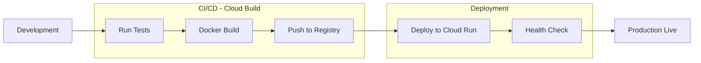

# Smart AAC System Architecture

## Overview

The Smart AAC (Augmentative and Alternative Communication) system is a production-ready, cloud-native application that leverages cutting-edge AI to help users create culturally-appropriate communication boards. Built on Google Cloud Platform with a modern serverless architecture, the system combines React frontend, Node.js backend, and advanced Vertex AI capabilities to deliver an accessible, scalable communication platform.

**Status**: ✅ Production Ready | **Version**: 2.0 | **Last Updated**: November 2024

## System Architecture

### High-Level Architecture



## Technology Stack

### Frontend Stack
- **Framework**: React 18+ with TypeScript
- **State Management**: React Context API + useReducer
- **Routing**: React Router v6
- **Authentication**: Firebase Authentication SDK v9+
- **HTTP Client**: Axios with interceptors
- **Styling**: CSS Modules with responsive design
- **Build Tool**: Vite
- **Testing**: Jest + React Testing Library
- **Deployment**: Firebase Hosting with CDN

### Backend Stack
- **Runtime**: Node.js 18+
- **Framework**: Express.js 4.18+
- **Language**: JavaScript (CommonJS)
- **Authentication**: Firebase Admin SDK 11+
- **Database**: Google Cloud Firestore 7.1+
- **Storage**: Google Cloud Storage 7.7+
- **AI Platform**: Google Vertex AI 1.10+
- **Documentation**: Swagger/OpenAPI 3.0
- **Container**: Docker multi-stage builds
- **Deployment**: Google Cloud Run (serverless)
- **Monitoring**: Google Cloud Operations Suite

### AI Models (Optimized)
- **Text-to-Icon**: `imagen-4.0-fast-generate-001`
- **Image Analysis**: `gemini-2.5-flash-image`

## Component Architecture

### Frontend Architecture

#### Directory Structure
```
frontend/
├── src/
│   ├── components/           # Reusable UI components
│   │   ├── common/          # Generic components (Button, Input, Modal)
│   │   ├── boards/          # Board management components
│   │   ├── icons/           # Icon generation interface
│   │   └── auth/            # Authentication flows
│   ├── pages/               # Route-level page components
│   ├── services/            # API integration layer
│   │   ├── api.js          # Axios configuration
│   │   ├── auth.js         # Authentication service
│   │   ├── boards.js       # Board API calls
│   │   └── icons.js        # Icon generation API
│   ├── hooks/               # Custom React hooks
│   │   ├── useAuth.js      # Authentication hook
│   │   ├── useBoards.js    # Board management hook
│   │   └── useIcons.js     # Icon generation hook
│   ├── contexts/            # React Context providers
│   │   ├── AuthContext.js  # User authentication state
│   │   └── ThemeContext.js # UI theme management
│   ├── types/               # TypeScript type definitions
│   ├── utils/               # Utility functions
│   └── assets/              # Static assets
├── public/                  # Public assets
└── tests/                   # Test files
```

#### Key Features
- **Progressive Web App**: Offline support with service workers
- **Responsive Design**: Mobile-first approach with breakpoints
- **Accessibility**: WCAG 2.1 AA compliant
- **Performance**: Code splitting and lazy loading
- **Error Boundaries**: Graceful error handling

### Backend Architecture

#### Service Layer Structure
```
backend/
├── src/
│   ├── server.js                    # Application entry point
│   ├── config/
│   │   └── swagger.js              # OpenAPI documentation config
│   ├── middleware/
│   │   ├── auth.js                 # JWT authentication
│   │   ├── upload.js               # Multer file upload
│   │   └── errorHandler.js         # Global error handling
│   ├── routes/
│   │   ├── health.js               # Health monitoring (2 endpoints)
│   │   ├── userProfile.js          # User profiles (9 endpoints)
│   │   ├── boards.js               # Board CRUD (6 endpoints)
│   │   └── icons.js                # Icon generation (7 endpoints)
│   ├── services/
│   │   ├── vertexai.js             # AI service integration
│   │   ├── firestore.js            # Database operations
│   │   ├── storage.js              # Cloud Storage management
│   │   ├── icons.js                # Icon management service
│   │   ├── boards.js               # Board management service
│   │   ├── userProfile.js          # Profile management service
│   │   └── culture.js              # Cultural context service
│   └── utils/
│       ├── logger.js               # Structured logging
│       └── validation.js           # Input validation
├── scripts/                         # Utility and test scripts
├── postman/                         # API testing collection
├── deployment/                      # Deployment configurations
└── Dockerfile                       # Container definition
```

#### API Endpoints (24 Total)

**Health & Monitoring (2)**
- `GET /health` - Basic health check
- `GET /api/v1/health` - Detailed service health

**User Profile Management (9)**
- `GET /api/v1/profile/status` - Profile completion status
- `GET /api/v1/profile` - Get user profile
- `POST /api/v1/profile` - Create profile
- `PUT /api/v1/profile` - Update complete profile
- `PUT /api/v1/profile/step/{step}` - Update onboarding step
- `PATCH /api/v1/profile/section/{section}` - Update profile section
- `GET /api/v1/profile/cultural-context` - Get cultural context
- `POST /api/v1/profile/validate` - Validate profile data
- `DELETE /api/v1/profile` - Delete profile

**Board Management (6)**
- `POST /api/v1/boards` - Create board
- `GET /api/v1/boards` - List user boards (paginated)
- `GET /api/v1/boards/public` - Browse public boards
- `GET /api/v1/boards/{id}` - Get specific board
- `PUT /api/v1/boards/{id}` - Update board
- `DELETE /api/v1/boards/{id}` - Delete board

**AI Icon Generation & Management (7)**
- `POST /api/v1/icons/generate-from-text` - Generate from text
- `POST /api/v1/icons/generate-from-image` - Generate from image
- `GET /api/v1/icons` - List user icons (paginated)
- `GET /api/v1/icons/search` - Search icons
- `GET /api/v1/icons/stats` - Get usage statistics
- `GET /api/v1/icons/{id}` - Get icon details
- `DELETE /api/v1/icons/{id}` - Delete icon

## Data Architecture

### Firestore Database Design

#### Collections
```
firestore/
├── aac_boards/              # Communication boards
│   └── {boardId}            # Board documents
├── user_profiles/           # User profile data
│   └── {userId}             # Profile documents
├── user_icons/              # Generated icon metadata
│   └── {iconId}             # Icon documents
└── _health_check/           # System health monitoring
```

#### Data Models

**User Profile**
```typescript
interface UserProfile {
  userId: string;
  location: {
    country: string;          // max 100 chars
    region: string;           // max 100 chars
  };
  languages: {
    primary: {
      language: string;
      dialect: string;
    };
    secondary?: {
      language: string;
      dialect: string;
    };
  };
  demographics: {
    age?: number;             // 1-120
    gender?: string;          // max 50 chars
    religion?: string;        // max 100 chars
    ethnicity?: string;       // max 100 chars
  };
  profileComplete: boolean;
  onboardingStep: 'location' | 'languages' | 'demographics' | 'completed';
  metadata: {
    version: number;
    lastUpdated: Timestamp;
  };
  createdAt: Timestamp;
  updatedAt: Timestamp;
}
```

**AAC Board**
```typescript
interface AACBoard {
  id: string;
  userId: string;
  name: string;              // max 100 chars
  description: string;       // max 500 chars
  isPublic: boolean;
  icons: BoardIcon[];        // max 50 items
  createdAt: Timestamp;
  updatedAt: Timestamp;
}

interface BoardIcon {
  id: string;
  text: string;
  imageUrl?: string;
  position: { x: number; y: number };
  category?: string;
  color?: string;
}
```

**Icon Metadata**
```typescript
interface IconMetadata {
  id: string;
  userId: string;
  publicUrl: string;
  filename: string;
  mimeType: string;
  size: number;              // bytes
  iconType: 'generated' | 'uploaded' | 'custom';
  generationMethod: 'text-to-icon' | 'image-to-icon';
  prompt?: string;
  originalText?: string;
  originalImageInfo?: {
    filename: string;
    size: number;
    mimetype: string;
  };
  analysisData?: {
    description: string;
    analysisType: string;
    confidence: string;
  };
  culturalContext?: CulturalContext;
  tags: string[];
  createdAt: Timestamp;
}
```

**Cultural Context**
```typescript
interface CulturalContext {
  language: string;          // ISO language code
  dialect?: string;
  region: string;
  country: string;
  symbolStyle: 'simple' | 'cartoon' | 'modern';
  culturalAdaptation: boolean;
  demographics?: {
    age?: number;
    gender?: string;
    religion?: string;
    ethnicity?: string;
  };
}
```

### Cloud Storage Structure
```
gs://bucket-name/
└── icons/
    └── {userId}/
        └── {timestamp}-{iconId}.png
```

## AI Integration Architecture

### Vertex AI Service

#### Simplified Model Strategy
The system uses a streamlined two-model approach for optimal performance:

1. **Text-to-Icon Generation**: `imagen-4.0-fast-generate-001`
   - Fast generation (3-5 seconds)
   - High-quality AAC-optimized icons
   - Cultural context integration
   - Accessibility-focused prompts

2. **Image Analysis**: `gemini-2.5-flash-image`
   - Advanced image understanding
   - Key element extraction
   - Cultural sensitivity
   - Detailed descriptions for icon generation

#### Icon Generation Pipeline



#### Cultural Prompt Engineering

The system constructs culturally-aware prompts by integrating:

1. **Language Context**: Primary/secondary languages and dialects
2. **Geographic Context**: Country and region-specific visual conventions
3. **Demographic Adaptation**:
   - Age-appropriate complexity and style
   - Religious and cultural sensitivities
   - Ethnic representation considerations
   - Gender-inclusive perspectives
4. **Accessibility Requirements**:
   - High contrast
   - Simple, clear design
   - 2D flat style
   - Minimal colors
   - Single focused object

**Example Prompt Construction**:
```javascript
// Base prompt
"Create a simple, accessible 2D icon representing 'happy cat'. "

// + Accessibility constraints
"The icon should be: simple and clear, high contrast, minimal colors, "
"2D flat design, easily recognizable, suitable for AAC communication. "

// + Cultural context
"Consider English (American English) cultural context and visual conventions. "
"Appropriate for United States (California) cultural norms and expectations. "

// + Demographics
"Modern, contemporary style appropriate for young adults. "
"Respectful of Christianity cultural values and sensitivities. "
"Consider Hispanic/Latino cultural perspectives and representation. "

// + Final constraints
"No text in the image. Clean white background. Single focused object."
```

## Security Architecture

### Authentication & Authorization

**Firebase Authentication Flow**:


### Security Layers

1. **Transport Security**
   - HTTPS/TLS 1.3 for all communications
   - SSL termination at Cloud Load Balancer
   - Secure WebSocket connections

2. **Authentication**
   - Firebase JWT tokens with expiration
   - Token refresh mechanism
   - Secure token storage (httpOnly cookies)

3. **Authorization**
   - User-based access control
   - Resource ownership validation
   - Public/private board permissions

4. **Input Validation**
   - Client-side validation
   - Server-side validation
   - Request body sanitization
   - File upload validation (type, size)

5. **API Security**
   - Helmet.js security headers
   - CORS configuration
   - Rate limiting (planned)
   - Request logging with correlation IDs

6. **Data Security**
   - Firestore security rules
   - Encrypted data at rest
   - Encrypted data in transit
   - PII handling compliance

### Firestore Security Rules
```javascript
rules_version = '2';
service cloud.firestore {
  match /databases/{database}/documents {
    // Helper function
    function isOwner(userId) {
      return request.auth != null && request.auth.uid == userId;
    }
    
    // User profiles - private
    match /user_profiles/{userId} {
      allow read, write: if isOwner(userId);
    }
    
    // Boards - owner or public
    match /aac_boards/{boardId} {
      allow read: if isOwner(resource.data.userId) || 
                     resource.data.isPublic == true;
      allow write: if isOwner(resource.data.userId);
    }
    
    // Icons - owner only
    match /user_icons/{iconId} {
      allow read, write: if isOwner(resource.data.userId);
    }
  }
}
```

## Deployment Architecture

### Google Cloud Platform Services

**Core Services**:
- **Cloud Run**: Serverless container hosting with auto-scaling (0-10 instances)
- **Firebase Hosting**: Static site hosting with global CDN
- **Cloud Load Balancer**: Traffic distribution and SSL termination
- **Cloud Storage**: Object storage for generated icons
- **Firestore**: NoSQL database with real-time sync
- **Vertex AI**: AI/ML services (Imagen + Gemini)
- **Cloud Monitoring**: Application performance monitoring
- **Cloud Logging**: Centralized structured logging
- **Cloud Build**: CI/CD pipeline automation

### Container Architecture

**Multi-Stage Docker Build**:
```dockerfile
# Stage 1: Dependencies
FROM node:18-alpine AS dependencies
WORKDIR /app
COPY package*.json ./
RUN npm ci --only=production

# Stage 2: Production
FROM node:18-alpine
WORKDIR /app
COPY --from=dependencies /app/node_modules ./node_modules
COPY . .
USER node
EXPOSE 8080
CMD ["node", "src/server.js"]
```

**Container Features**:
- Non-root user for security
- Health check endpoints
- Graceful shutdown handling
- Environment-based configuration
- Minimal attack surface

### Deployment Pipeline



### Environment Configuration

**Development**:
- Local Node.js server with hot reload
- Firestore emulator (optional)
- Local environment variables
- Debug logging enabled

**Production**:
- Cloud Run serverless containers
- Auto-scaling (0-10 instances)
- Production Firestore
- Structured logging
- Health monitoring
- Error tracking

## Performance Architecture

### Scalability Design

**Frontend**:
- CDN distribution (Firebase Hosting)
- Edge caching for static assets
- Code splitting and lazy loading
- Service worker caching
- Optimized bundle sizes

**Backend**:
- Serverless auto-scaling (Cloud Run)
- Stateless API design
- Connection pooling
- Efficient database queries
- Composite indexes for Firestore

**Database**:
- Firestore auto-scaling
- Composite indexes for complex queries
- Query result caching
- Pagination for large datasets

**AI Services**:
- Optimized model selection
- Request queuing
- Retry logic with exponential backoff
- Fallback mechanisms

### Performance Metrics

**Target Performance**:
- Frontend Load Time: < 3 seconds on 3G
- API Response Time: < 500ms for CRUD operations
- Icon Generation: 3-5 seconds for AI processing
- Database Queries: < 100ms for indexed queries
- Health Check: < 50ms response time

### Caching Strategy

1. **Frontend Caching**:
   - Service Worker for offline support
   - LocalStorage for user preferences
   - Session storage for temporary data

2. **API Caching**:
   - Response caching for public endpoints
   - ETags for conditional requests
   - Cache-Control headers

3. **CDN Caching**:
   - Static asset caching (1 year)
   - Cache invalidation on deployment
   - Gzip compression

## Monitoring & Observability

### Health Monitoring

**Basic Health Check** (`/health`):
```json
{
  "status": "healthy",
  "timestamp": "2024-11-08T12:00:00.000Z",
  "uptime": 3600,
  "environment": "production"
}
```

**Detailed Health Check** (`/api/v1/health`):
```json
{
  "status": "healthy",
  "timestamp": "2024-11-08T12:00:00.000Z",
  "uptime": 3600,
  "environment": "production",
  "services": {
    "firebase_auth": {
      "status": "healthy",
      "message": "Firebase Auth connection successful"
    },
    "firestore": {
      "status": "healthy",
      "message": "Firestore connection successful"
    },
    "vertex_ai": {
      "status": "healthy",
      "message": "Vertex AI services initialized and ready",
      "details": {
        "projectId": "your-project-id",
        "location": "us-central1"
      }
    },
    "environment": {
      "status": "healthy",
      "message": "All required environment variables are set"
    },
    "logging": {
      "status": "healthy",
      "message": "Logging system operational"
    }
  }
}
```

### Structured Logging

**Log Levels**:
- `DEBUG`: Detailed diagnostic information
- `INFO`: General informational messages
- `WARN`: Warning messages for potential issues
- `ERROR`: Error messages with stack traces

**Log Format**:
```json
{
  "timestamp": "2024-11-08T12:00:00.000Z",
  "level": "INFO",
  "message": "Icon generated successfully",
  "context": {
    "userId": "user123",
    "iconId": "icon456",
    "generationMethod": "text-to-icon",
    "duration": 3500
  },
  "correlationId": "req-abc123"
}
```

### Error Tracking

**Error Response Format**:
```json
{
  "error": "Human-readable error message",
  "code": "MACHINE_READABLE_CODE",
  "details": ["Additional error details"],
  "timestamp": "2024-11-08T12:00:00.000Z"
}
```

**Error Categories**:
- Authentication Errors (401, 403)
- Validation Errors (400)
- Not Found Errors (404)
- Conflict Errors (409)
- Server Errors (500, 503)

### Monitoring Dashboards

**Key Metrics**:
- Request rate and latency
- Error rate by endpoint
- AI generation success rate
- Database query performance
- Container resource utilization
- User authentication events

## Development Workflow

### Local Development Setup

```bash
# 1. Install dependencies
npm install

# 2. Configure environment
cp .env.example .env
# Edit .env with your credentials

# 3. Initialize services
npm run setup:firestore
node scripts/setup-storage-bucket.js

# 4. Start development server
npm run dev

# 5. Access API documentation
open http://localhost:8080/api-docs
```

### Testing Strategy

**Test Types**:
1. **Unit Tests**: Service layer and utility functions
2. **Integration Tests**: API endpoint testing
3. **E2E Tests**: Complete user workflows
4. **Performance Tests**: Load testing for AI endpoints

**Test Commands**:
```bash
# Run all tests
npm test

# Test AI models
npm run test:ai-models

# Test API endpoints
npm run test:api

# Test complete workflow
node scripts/test-complete-workflow.js
```

### API Documentation

**Interactive Documentation**:
- Swagger UI at `/api-docs`
- OpenAPI 3.0 specification
- Live endpoint testing
- Request/response examples
- Schema validation

**Postman Collection**:
- Complete endpoint coverage
- Automated test scripts
- Environment variables
- Pre-request scripts
- Test assertions

## Key Architectural Decisions

### 1. Simplified AI Model Strategy
**Decision**: Use only two AI models instead of complex fallback chains
**Rationale**: 
- Faster, more predictable responses
- Easier to maintain and debug
- Lower operational complexity
- Better cost management

### 2. Serverless Architecture
**Decision**: Deploy on Cloud Run instead of traditional VMs
**Rationale**:
- Auto-scaling from 0 to 10 instances
- Pay-per-use pricing model
- No infrastructure management
- Built-in load balancing

### 3. Firestore for Database
**Decision**: Use Firestore instead of SQL database
**Rationale**:
- Real-time synchronization
- Offline support
- Auto-scaling
- Flexible schema
- Built-in security rules

### 4. Cultural Context Integration
**Decision**: Comprehensive user profiling for AI personalization
**Rationale**:
- Culturally-appropriate icon generation
- Better user experience
- Inclusive design
- Accessibility focus

### 5. Comprehensive API Documentation
**Decision**: Swagger/OpenAPI with interactive testing
**Rationale**:
- Developer-friendly
- Self-documenting code
- Easy integration testing
- Clear API contracts

## Future Enhancements

### Planned Features
1. **Rate Limiting**: Per-user and global rate limits
2. **Caching Layer**: Redis for API response caching
3. **Analytics**: User behavior and usage analytics
4. **Internationalization**: Multi-language UI support
5. **Batch Operations**: Bulk icon generation
6. **Advanced Search**: Full-text search with Algolia
7. **Collaboration**: Shared board editing
8. **Export/Import**: Board backup and restore

### Scalability Roadmap
1. **Database Sharding**: For large-scale deployments
2. **Multi-Region**: Global deployment for low latency
3. **CDN Optimization**: Advanced caching strategies
4. **AI Model Fine-Tuning**: Custom models for specific use cases
5. **Microservices**: Split into specialized services

## Conclusion

The Smart AAC system represents a modern, production-ready application that successfully combines:

- **Cloud-Native Architecture**: Serverless, scalable, and cost-effective
- **Advanced AI Integration**: Cutting-edge Vertex AI with cultural awareness
- **Enterprise Security**: Comprehensive authentication and authorization
- **Developer Experience**: Excellent documentation and testing tools
- **Operational Excellence**: Monitoring, logging, and health checks
- **Accessibility Focus**: WCAG compliant and AAC-optimized

The architecture is designed for reliability, scalability, and maintainability, with clear separation of concerns and modern best practices throughout.

---

**Document Version**: 2.0  
**Last Updated**: November 8, 2024  
**Status**: Production Ready ✅
